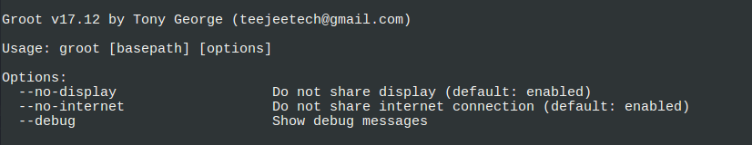

## Groot

Groot is a tiny utility for chrooting into an installed Linux system. It is similar to the **arch-chroot** command available on Arch Linux, and is based on the same script. It can be used on any Linux distribution.

### Chroot Basics

A chroot session changes the effective root directory to a specified path where another Linux system is installed.  Applications running inside the chroot will only affect the chrooted system and cannot access or modify files outside the chroot jail.

This is useful for maintenance activities. You can add/remove software and run commands for updating the chrooted system. You can fix boot issues, and execute GUI applications without any worry of the applications affecting your current system.

Chroot requires root access. The current system (host) and the chrooted system (guest) must have the same architecture (i686, x86_64, etc). The host kernel is shared with guest system. Kernel modules required by the guest must be loaded on the host.

## Usage



To chroot into a system, open a terminal window, **cd** to path where root filesystem is mounted and run the **groot** command.

```
cd /media/usbdrive
sudo groot
```

This will mount `/dev`, `/run`, `/sys` and other system directories; and chroot to the current directory.

You can also specify root path as an optional argument.

```
sudo groot /mnt/usbdrive
```

Type **exit** when you are done, to exit the session cleanly. *This is important*. If you don’t exit the session properly, the system subdirectories will remain mounted, and you may have to reboot the system.

**Internet Sharing**

Internet connection sharing is enabled by default. You can run commands that access the internet. Use option `--no-internet` if internet sharing is not required.

**Display Sharing**

Display sharing is enabled by default. You can run GUI applications that are installed on chrooted system. Use option `--no-display` if display sharing is not required.

## Features

* Automatic mounting and unmounting of /dev, /run, /proc, /sys and other system directories
* Enables internet sharing to allow applications to connect to internet from chroot session
* Enables display sharing to allow GUI applications to run from chroot session

**Planned features:**

* Repairing boot issues on BIOS and EFI systems
* Re-install GRUB, rebuild initramfs, update grub menu, etc

## Installation

Binary installers are available on the [Releases](https://github.com/teejee2008/groot/releases) page.  
Run following commands in a terminal window:

```sh
# 64-bit
sudo chmod a+x ./groot*amd64.run
sudo ./groot*amd64.run

# 32-bit
sudo chmod a+x ./groot*i386.run
sudo ./groot*i386.run
```

## Donate

**PayPal** ~ If you find this application useful and wish to say thanks, you can buy me a coffee by making a one-time donation with Paypal. 

[](https://www.paypal.com/cgi-bin/webscr?business=teejeetech@gmail.com&cmd=_xclick&currency_code=USD&amount=10&item_name=Groot%20Donation)  

**Patreon** ~ You can also sign up as a sponsor on Patreon.com. As a patron you will get access to beta releases of new applications that I'm working on. You will also get news and updates about new features that are not published elsewhere.

[](https://www.patreon.com/bePatron?u=3059450)

**Bitcoin** ~ You can send bitcoins at this address or by scanning the QR code below:

```1Js5vfgmwKew4byF9unWacwAjBQVvZ3Fev```


